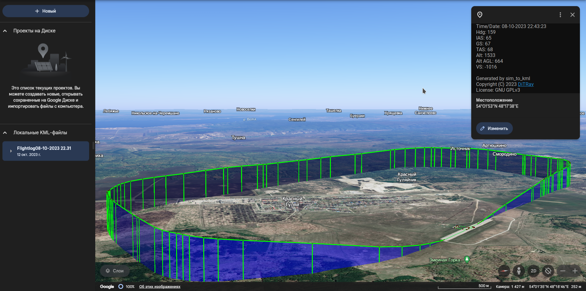

# sim_to_kml
Python script to convert flight simulator data to KML format
similar to BlackBox flightlogger

## Supported software
Currently, FlightGear and X-Plane 11 are supported. However, other versions of X-Plane might also work, though they were not tested yet. The operating system does not matter, which is the main goal of the project.

## Requirements:
- Python 3.6 or later
- Python modules:
    - Pandas
    - YAML
    - simplekml

## Usage:
### 1. Data capture
In order to receive flight data from a simulator, the latter should be configured properly.
### 1.1. X-Plane 11
Go to the Settings menu, and navigate to "Data Output" tab and "General Data Output" subtab. In the table in the column "Disk (data.txt) File" check boxes for the following options:
- Timers (1)
- Speeds (3)
- Mach, VVI, g-load (4)
- Trim, flap, stats, & speedbrakes (13)
- Pitch, roll, & headings (17)
- Latitude, longitude, & altitude (20)
- Marker status (105)
- Warning status (127)

___Optional.___ _You might also want to check those options in the "Show in cockpit" column in order to see all parameters in flight. Though, it is not recommended as it could distract the pilot, which is not what we want to get during critical stages of flight._

___Optional.___ _In addition, you might want to play with the "Disk Rate" parameter. In sets data write times per second. Howver, the default value of 10 is recommended._

Now, after every flight you should find "Data.txt" file in your X-Plane 11 installation folder.

### 1.2 FlightGear
### 1.2.1 Install plugin
Copy sim_to_kml.py from Protol folder to the existing Protocol folder in your FlightGear instalation directory ($FG_ROOT/Protocol).
### 1.2.2 Run plugin
In FlightGear launcher window under __Settings__ -> __Additional settings__ or in command line as an argument to fgfs add the following text, replacing \<Export dir\> with the path to the desired flight log output directory:
```
--generic=file,out,10,<Export dir>/flightlog.csv,sim_to_kml
```
___Remark.___ _You should probaably use backslash ("\\") if running on Windows._

### 2. Run the script
Use the following syntax:
```
sim_to_kml.py src_file [dst_file]
```
"src_file" is a path to X-Plane's Data.txt or flightlog.csv from the plugin for FlightGear.

"dst_file" is a path to the file you would like to get. If not stated, the file will be called "Flightlog \<flight-date/time\>.kml" in the current folder.


### Preview:


