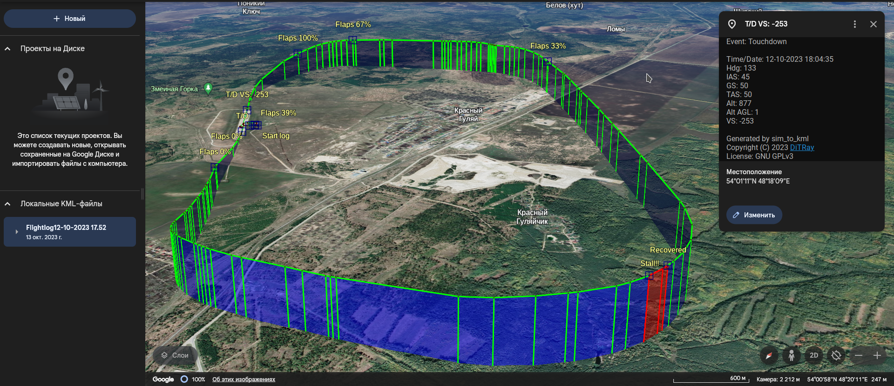

# sim_to_kml
Python script to convert flight sim data to KML format
similar to BlackBox flightlogger

### Requirements:
- Python 3.6 or later
- Python modules:
    - Pandas
    - YAML
    - simplekml

### Usage:
```
sim_to_kml.py src_file [dst_file]
```

"src_file" is a path to X-Plane's Data.txt
or flightlog.csv from the plugin for FlightGear (will be added later).


### Preview:



The project is now under heavy development.
Currently, the X-Plane part is feature complete.
Now the main effort is put on FlightGear support.
